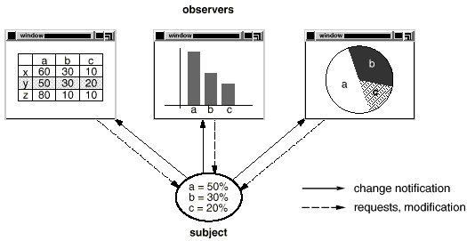
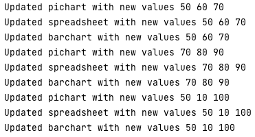

# Strategy Pattern

### Definition
Define a one-to-many dependency between objects so that when one object changes state, all its dependents are notified and updated automatically.

### Real Usecase
For example, many graphical user interface toolkits separate the presentational aspects of the user interface from the underlying application data.

So that classes defining application data and presentations can be reused independently.

When the user changes the information in the spreadsheet, the bar chart reflects the changes immediately, and vice versa.

This behavior implies that the spreadsheet and bar chart are dependent on the data object and therefore should be notified of any change in its state.

The Observer pattern describes how to establish these relationships. The key objects in this pattern are **subject** and **observer**.

A subject may have any number of dependent observers. All observers are notified whenever the subject undergoes a change in state. In response, each observer will query the subject to synchronize its state with the subject's state.

### Applicability

- When a change to one object requires changing others, and you don't know how many objects need to be changed.

### Example
**Q. Implement a system where you have to show diff types of view ( BarChart, PiChart, SpreadSheet ) on every update of student marks.**

**A.** We will follow the below steps:
- First of all we will create the interface for Subject
- Then we will create the concrete implementation of our subject ( i.e StudentMarksUpdater )
- Then we will create the interface for Observer
- Then we will create the concrete implementations of our different observers.

```java
public interface Subject<T> {

    public void addObserver(Observer<T> o);
    public void removeObserver(Observer<T> o);
    public void notifyObserver(T msg);
}
```

```java
import java.util.ArrayList;

public class StudentMarksUpdater<T> implements Subject<T> {

    private ArrayList<Observer<T>> observers;

    public StudentMarksUpdater() {
        observers = new ArrayList<>();
    }
    
    @Override
    public void addObserver(Observer<T> o) {
        observers.add(o);
    }

    @Override
    public void removeObserver(Observer<T> o) {
        observers.remove(o);
    }

    @Override
    public void notifyObserver(T msg) {
        for( Observer<T> obs : observers ) {
            obs.update(msg);
        }
    }
}
```

```java
public interface Observer<T> {
    void update(T data);
}
```

```java
public class BarChart<T> implements Observer<T> {
    @Override
    public void update(T data) {
        System.out.println("Updated barchart with new values" + data.toString());
    }
}
```

```java
public class PiChart<T> implements Observer<T> {
    @Override
    public void update(T data) {
        System.out.println("Updated pichart with new values" + data.toString());
    }
}
```

```java
public class SpreadSheet<T> implements Observer<T>{
    @Override
    public void update(T data) {
        System.out.println("Updated spreadsheet with new values" + data.toString());
    }
}
```

```java
public class DisplayStudentMarksTest {
    public static void main(String[] args) {
        StudentMarksUpdater<PCMMarks> pcmMarksUpdater = new StudentMarksUpdater<>();

        PiChart<PCMMarks> piChart = new PiChart<>();
        SpreadSheet<PCMMarks> spreadSheet = new SpreadSheet<>();
        BarChart<PCMMarks> barChart = new BarChart<>();

        pcmMarksUpdater.addObserver(piChart);
        pcmMarksUpdater.addObserver(spreadSheet);
        pcmMarksUpdater.addObserver(barChart);

        pcmMarksUpdater.notifyObserver(new PCMMarks(50, 60, 70));
        pcmMarksUpdater.notifyObserver(new PCMMarks(70, 80, 90));
        pcmMarksUpdater.notifyObserver(new PCMMarks(50, 10, 100));
    }
}
```


### Output
