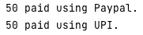

# Observer Pattern

### Definition
Strategy pattern is used when we have multiple algorithms for a specific task and client decides the actual implementation to be used at runtime i.e we define multiple algorithms and let client application pass the algorithm to be used as a parameter.

### Real Usecase
One of the best example of this is `Collections.sort()` method that takes Comparator parameter. Based on the different implementations of Comparator interface, the objects are getting sorted in different ways.

### Example 
**Q. Implement a simple shopping cart where we have three payment strategies - using credit card, paypal or UPI.**

**A.** We will follow the below steps:
- First of all we will create the interface for our payment strategy
- Then we will create the concrete implementation of our payment algorithms
- Then we will implement the shopping cart and payment method that will require input as payment strategy.


```java
public interface PaymentStrategy {

    public void pay(int amount);
}
```

```java
public class CreditCardStrategy implements PaymentStrategy {

    private String name;
    private String cardNumber;
    private String cvv;
    private String dateOfExpiry;

    public CreditCardStrategy(String name, String cardNumber, String cvv, String dateOfExpiry) {
        this.name = name;
        this.cardNumber = cardNumber;
        this.cvv = cvv;
        this.dateOfExpiry = dateOfExpiry;
    }
    
    @Override
    public void pay(int amount) {
        System.out.println(amount + " paid with credit card.");
    }
}
```

```java
public class PaypalStrategy implements PaymentStrategy {

    private String emailId;
    private String password;

    public PaypalStrategy(String emailId, String password) {
        this.emailId = emailId;
        this.password = password;
    }
    
    @Override
    public void pay(int amount) {
        System.out.println(amount + " paid using Paypal.");
    }
}
```

```java
public class UPIStrategy implements PaymentStrategy {

    private String upiId;
    private String upiPin;

    public UPIStrategy(String upiId, String upiPin) {
        this.upiId = upiId;
        this.upiPin = upiPin;
    }

    @Override
    public void pay(int amount) {
        System.out.println(amount + " paid using UPI.");
    }
}
```

```java
public class Item {

    private String uCode;
    private int price;

    public Item(String uCode, int price) {
        this.uCode = uCode;
        this.price = price;
    }

    public int getPrice() {
        return price;
    }

    public String getUCode() {
        return uCode;
    }
}
```

```java
import java.util.ArrayList;
import java.util.List;

public class ShoppingCart {

    List<Item> items;

    public ShoppingCart() {
        this.items = new ArrayList<>();
    }

    public void addItem(Item item) {
        this.items.add(item);
    }

    public void removeItem(Item item) {
        this.items.remove(item);
    }

    public int calculateTotal() {
        int sum = 0;
        for( Item item : items ) {
            sum += item.getPrice();
        }
        return sum;
    }

    public void pay(PaymentStrategy paymentMethod) {
        int amount = calculateTotal();
        paymentMethod.pay(amount);
    }
}
```

```java
public class ShoppingCardTest {

    public static void main(String[] args) {
        ShoppingCart cart = new ShoppingCart();
        Item item1 = new Item("1234", 10);
        Item item2 = new Item("5678", 40);
        cart.addItem(item1);
        cart.addItem(item2);

        // pay by PayPal
        cart.pay(new PaypalStrategy("cenation092@gmail.com", "1234"));

        // pay by upi id
        cart.pay(new UPIStrategy("cenation092", "1234"));
    }
}
```
### Output


### Real-World Analogy


Various strategies for getting to the airport.


